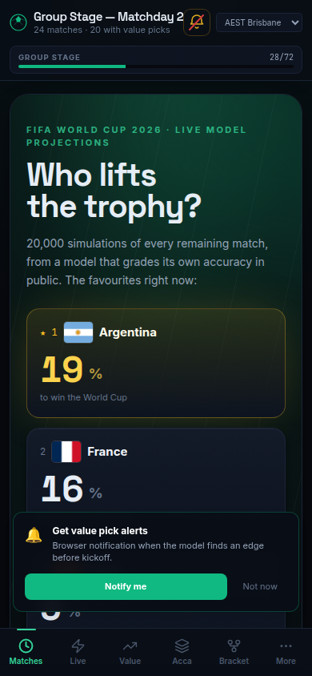
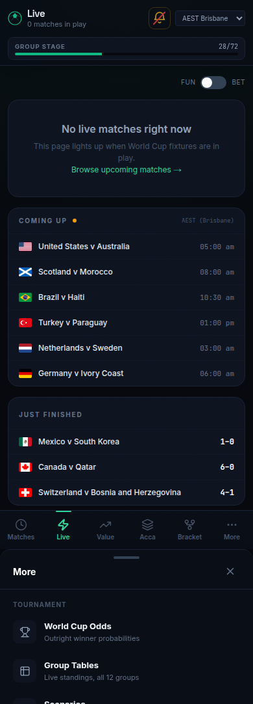
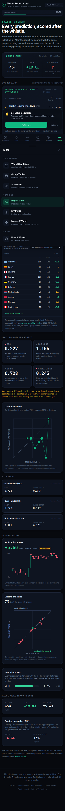
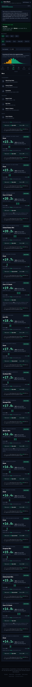
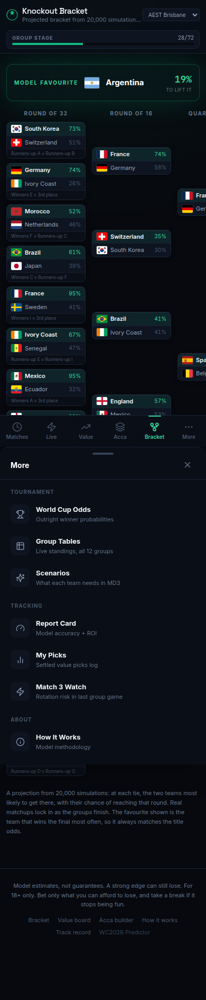

  

  <h1>WC2026 Predictor</h1>

  
<strong>Every match. Every market. Free.</strong>

  <h3><a href="https://wc26.tinjak.com">▶ Open the live site →</a></h3>

  Data-driven probabilities for the 2026 FIFA World Cup. No sign-up. Works on mobile.

---

  

## See it in action

<table>
<tr>
<td width="50%">

### Watch it live →

In-play probability swing chart. Goals push it, red cards crash it. Save any moment as a share image.

</td>
<td width="50%">

### Score every prediction →

Hit rate, Brier, head-to-head vs the bookmaker market and the Opta supercomputer. No cherry-picking.

</td>
</tr>
<tr>
<td>

### Spot value bets →

Daily curated multis. Settled in public. Running ROI on the page.

</td>
<td>

### Project the bracket →

The full knockout tree from 20,000 simulations. Last-32 to the final.

</td>
</tr>
</table>

## Why open it

- **Honest accuracy** — every pick is locked before kickoff, then graded after the result.
- **Real correlation pricing** — same-match multi legs go through the score grid, not multiplied as if they're independent.
- **Side-by-side with Opta** — see exactly where the model disagrees with the supercomputer, and why.
- **No paywall, no sign-up** — open the page, get the answer.

## What's inside

|  |  |
|---|---|
| **Match pages** | Win/draw/loss %, goals, exact scores, plain-English verdict |
| **Live swing chart** | Real-time win-probability with event ticker and stats strip |
| **Value board** | Best price across books, sized to your bankroll |
| **Bet builder** | Drop in any legs; correlation priced from the model |
| **Model picks** | Auto-curated balanced multis with a public running ROI |
| **Bracket & groups** | Projected knockout tree, live group tables, MD3 scenarios |
| **Push alerts** | Optional: pings for value picks and big live swings |

 

  <h3><a href="https://wc26.tinjak.com">Open the site →</a></h3>
  18+ only. Model estimates, not guarantees.

