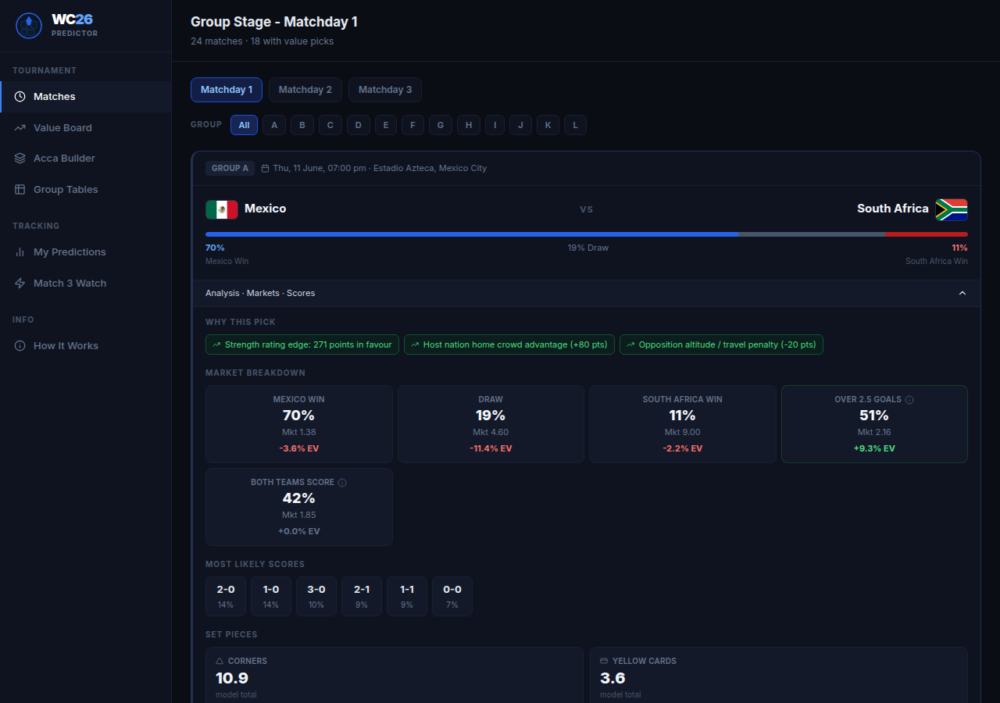
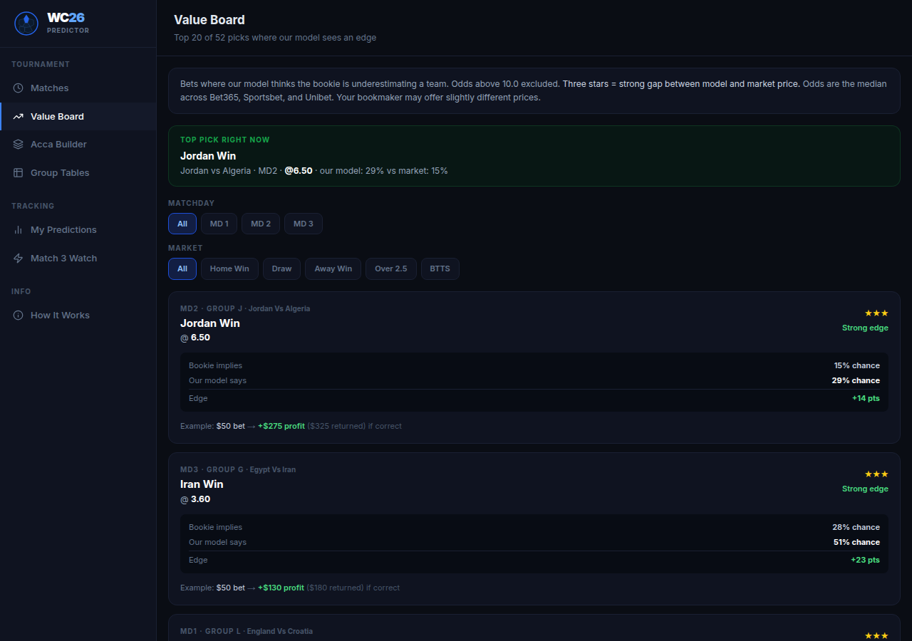

<div align="center">
  
  <h1>WC2026 Predictor</h1>
  <p>Data-driven match predictions for the 2026 FIFA World Cup</p>
  <a href="https://wc26.tinjak.com"><strong>wc26.tinjak.com →</strong></a>
  &nbsp;&nbsp;
  
  
  
</div>

---

## Screenshots

| Matches + predictions | Expanded match analysis |
|---|---|
|  |  |

| Value board | Multi builder |
|---|---|
|  |  |

---

## What it does

**Match predictions** — Win, draw, and loss probabilities for every group stage match. Powered by ELO ratings fed through a Poisson model. Covers all 12 groups and 3 matchdays.

**Value board** — Compares model probabilities against live odds from Bet365, Sportsbet, and Unibet. Surfaces markets where the bookie is underpricing a team. Filtered by matchday and market type.

**Multi builder** — Builds 3 to 5 leg multis from value picks. Filters out same-match doubles, caps odds at 8.0, and selects the combination with the highest expected value.

**Score matrix** — Full 9x9 scoreline probability grid per match. Most likely final scores ranked by probability.

**Set piece estimates** — Expected corners and yellow cards per game, calibrated to WC group stage data.

**Group tables** — Live standings across all 12 groups.

**Prediction tracker** — Pre-kickoff picks logged automatically. Settled after results come in with accuracy tracking.

**Match 3 watch** — Flags final group games with rotation or dead-rubber risk.

---

## Model

### ELO ratings

Ratings sourced from [eloratings.net](https://www.eloratings.net) and refreshed every 24 hours. Confederation offsets are applied before cross-confederation comparisons, and tapered by within-group rank. Stronger qualifiers from a weaker confederation receive a smaller penalty; weakest qualifiers from a strong confederation receive a smaller boost.

Confederation base offsets (applied to ELO before comparison):
- UEFA: +56 to +117 (Scotland to France)
- CONMEBOL: +42 to +104 (Paraguay to Argentina)
- AFC: +7 to +18 (Iraq to Japan)
- CONCACAF: -27 to -11 (Mexico to Haiti)
- CAF: -40 to -16 (Morocco to Cape Verde)
- OFC: -171 (New Zealand)

### Win probability

Standard ELO formula:

```
P(home win) = 1 / (1 + 10^(-(ELO_home_adj − ELO_away_adj) / 400))
```

### Expected goals (lambda)

ELO win probability is converted to Poisson rate parameters via a linear mapping calibrated to WC group stage scoring averages:

```
λ_home = max(0.1, 1.3 + 2.0 × (P(home win) − 0.5))
λ_away = max(0.1, 1.3 − 2.0 × (P(home win) − 0.5))
```

At equal strength (P = 0.5), both teams get λ = 1.3 goals — close to the WC group stage average of ~1.3 per team per game.

### Poisson model

A 9x9 score matrix is built from the two lambda values using independent Poisson distributions. All downstream probabilities (win/draw/loss, over/under 2.5, both teams score, Asian handicap, top scores) are derived from the same matrix.

### Form adjustment

Last 5 results are weighted (oldest = 0.1, most recent = 0.3) and applied as a lambda delta, clamped to ±0.10:

```
delta = weighted_sum(W=1, D=0, L=−1)  →  clamped to [−0.10, +0.10]
```

### Venue adjustments

Host nations (Canada, USA, Mexico) receive crowd advantage bonuses (+50 to +65 ELO). Mexico City and Guadalajara apply altitude adjustments for unadapted teams (−20 ELO) and a bonus for altitude-adapted teams (Colombia, Ecuador, Mexico: +15 ELO). Diaspora cities (Los Angeles, Dallas, Miami) add soft crowd boosts for relevant South American and Mexican teams.

### Corner model

```
E[corners] = 6.5 + (λ_home + λ_away) + 1.2 × |λ_home − λ_away|
```

Calibrated to a WC group stage average of ~9 corners per game, with a scaling term for match competitiveness.

### Card model

```
E[cards] = 2.8 + 2.0 × (1 − |P(home win) − P(away win)|)
```

Tension peaks when teams are evenly rated. Calibrated to WC 2022 group stage averages.

### Expected value

```
EV = (model_probability × decimal_odds) − 1
```

Positive EV means the model thinks the bookie is underpricing the outcome. Odds are the median of Bet365, Sportsbet, and Unibet via The Odds API.

### Kelly stake sizing

Quarter-Kelly is used for stake sizing:

```
full_kelly = (b × p − q) / b
quarter_kelly = full_kelly × 0.25
```

Where `b = decimal_odds − 1`, `p = model probability`, `q = 1 − p`. More conservative than full Kelly and better suited to a small sample like a group stage.

### Same-game multi (SGM) correlation

When combining markets from the same game, a correlation table adjusts the naive product probability. For example, home win + over 2.5 goals are positively correlated (factor 1.15) while draw + BTTS are negatively correlated (factor 0.85).

---

## Stack

| Layer | Tech |
|---|---|
| Frontend | Next.js 14 (App Router, SSR) |
| Backend | FastAPI + APScheduler |
| Database | SQLite via SQLAlchemy |
| Odds feed | The Odds API |
| ELO ratings | eloratings.net (scraped, 24h cache) |
| Form data | martj42/international_results (6h cache) |
| Deployment | Docker on VPS behind Nginx Proxy Manager |
| Tests | pytest (36 tests, pure logic) |

---

## Running locally

```bash
# Backend
cd backend
pip install -r requirements.txt
THE_ODDS_API_KEY=your_key uvicorn backend.api.main:app --reload

# Frontend
cd frontend
npm install
NEXT_PUBLIC_API_URL=http://localhost:8000 npm run dev
```

Set `THE_ODDS_API_KEY` in your environment for live odds. Without it, predictions still run but the value board will show no live markets.

```bash
# Tests
cd /path/to/repo
python -m pytest backend/tests/ -v
```

---

## Predictions accuracy

Every pre-kickoff prediction is logged to SQLite with the match, market, model probability, and bookmaker odds at time of logging. Settled after results come in. Track record is visible on the [Predictions](https://wc26.tinjak.com/predictions) page once games are played.
