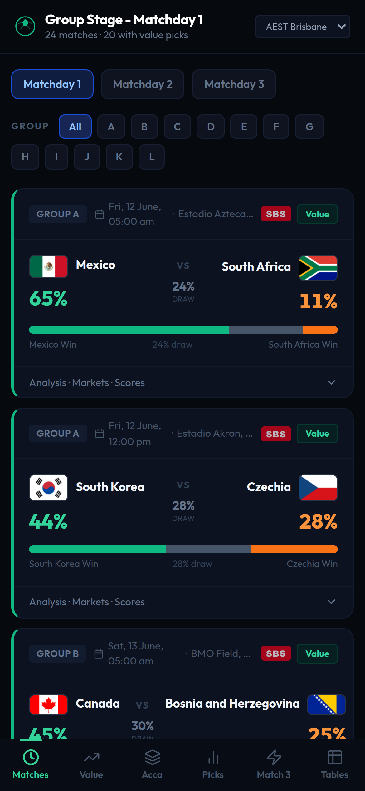
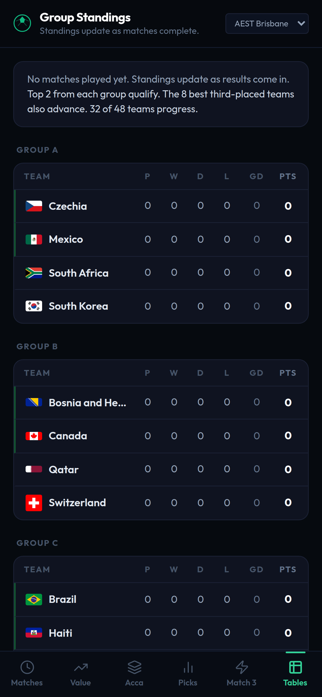
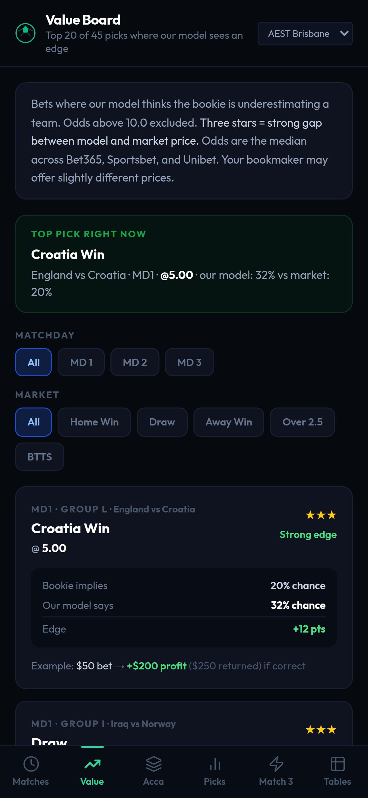
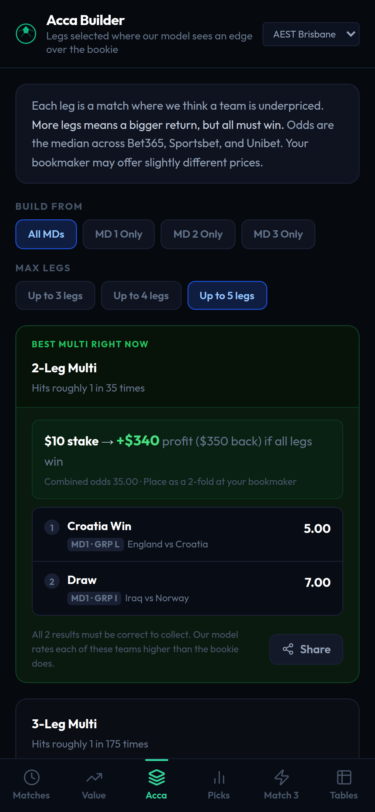
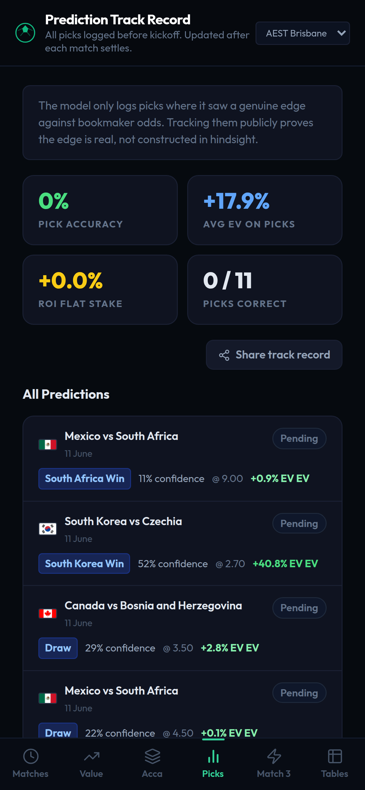
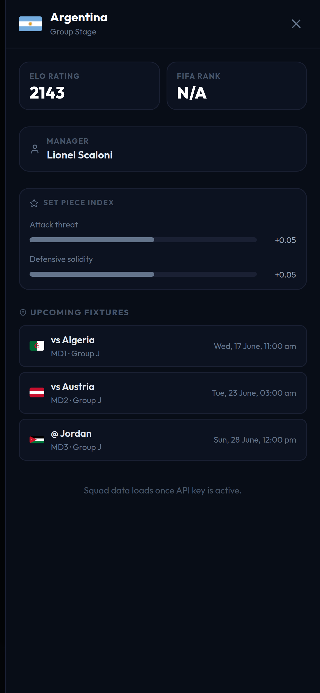

<div align="center">
  
  <h1>WC2026 Predictor</h1>
  <p>Data-driven match predictions for the 2026 FIFA World Cup</p>
  <a href="https://wc26.tinjak.com"><strong>wc26.tinjak.com →</strong></a>
  &nbsp;&nbsp;
  
  
  
</div>

---

## Live site

Follow along at **[wc26.tinjak.com](https://wc26.tinjak.com)** — predictions update as odds and lineups drop. Or [run your own instance](#running-your-own-instance) with Docker in under ten minutes.

---

## Screenshots

| Matches | Groups + team drawer |
|---|---|
|  |  |

| Value board | Acca builder |
|---|---|
|  |  |

| Predictions tracker | Team profile |
|---|---|
|  |  |

---

## By the numbers

| Stat | Value |
|---|---|
| Matches modelled | 72 |
| Nations | 48 across 6 confederations |
| Groups | 12 |
| Context multipliers | 9 |
| Model test coverage | 36 passing tests |
| Historical fit data | ~6 years of international results |
| Odds sources | Bet365, Sportsbet, Unibet |
| ELO ratings | eloratings.net (24h cache) |

---

## What it does

**Match predictions** — Win, draw, and loss probabilities for every group stage match. Dixon-Coles model blended with ELO, with 9 context multipliers covering rest, travel, weather, lineups, set pieces, H2H, and more.

**Team profiles** — Click any team in the group standings to slide out a full profile: ELO rating, FIFA rank, manager, upcoming fixtures, set piece attack and defence index, and the full squad grouped by position. Fixtures show in your local timezone automatically.

**Timezone picker** — Every kickoff time across the site renders in your timezone. Pick from AEST, AEDT, AWST, BST, ET, PT, JST, or UTC via the selector in the top bar. Default is AEST (Brisbane).

**Value board** — Compares model probabilities against live odds from Bet365, Sportsbet, and Unibet. Surfaces markets where the bookie is underpricing a team. Filtered by matchday and market type.

**Acca builder** — Builds 3 to 5 leg multis from value picks. Deduplicates by beneficiary so the same team can never appear twice in the same combo. Caps odds at 8.0 and selects the combination with the highest expected value.

**Score matrix** — Full 9x9 scoreline probability grid per match. Most likely final scores ranked by probability.

**Group tables** — Live standings across all 12 groups with WC2026 third-place qualification rules applied (best 8 of 12 third-placed teams advance).

**Prediction tracker** — Pre-kickoff picks logged automatically. Settled after results come in with accuracy tracking.

---

## Model

### The problem with a naive approach

Most public WC predictors either use raw ELO or a basic Poisson model. Both have the same failure mode: cross-confederation comparisons. An ELO of 1750 in CAF is not the same as 1750 in UEFA. Algeria built their defensive ELO rating by shutting out teams like Equatorial Guinea and Comoros. Running that number directly against Argentina produced Algeria with a 33% chance of winning — which is nonsense. The whole model architecture is designed around fixing that class of problem.

---

### Layer 1: Dixon-Coles MLE with time decay

The base layer is a [Dixon-Coles](http://www.math.su.se/matstat/reports/seriea/2000/rep2/report.pdf) model fitted on ~6 years of international results with exponential time decay (`ξ = 0.00325`), giving recent matches more weight. Dixon-Coles extends the basic Poisson model by adding a low-score correction factor (rho) that pulls probability mass from 1-0 and 2-0 results toward 0-0 and 1-1, which are systematically under-predicted by independent Poisson.

Each team gets two parameters:
- `alpha` — attacking strength (how many goals they score relative to expectation)
- `beta` — defensive strength (how few goals they concede relative to expectation)

These are fitted by maximum likelihood. 47 WC2026 teams had enough international data to fit.

**Why we don't use pure DC:** DC parameters are calibrated within-confederation. Algeria's beta is extremely negative (strong defender) because they were measured against CAF opposition. Running that against Argentina's alpha directly inflates Algeria. This is a known problem with any club-season model applied across leagues, just applied here across confederations.

---

### Layer 2: Confederation-aware ELO blend

We apply a blending weight based on confederation distance:

```
Cross-confederation (offset diff > 50):  50% DC + 50% ELO
Same-confederation:                       75% DC + 25% ELO
```

ELO ratings are sourced from [eloratings.net](https://www.eloratings.net) — they encode real WC tournament performance including cross-confederation matches, so they provide a sensible anchor when DC parameters are unreliable.

Confederation base offsets (applied to ELO before comparison, derived from historical WC performance):

| Confederation | Range | Notes |
|---|---|---|
| UEFA | +56 to +117 | Scotland to France |
| CONMEBOL | +42 to +104 | Paraguay to Argentina |
| AFC | +7 to +18 | Iraq to Japan |
| CONCACAF | -27 to -11 | Haiti to Mexico |
| CAF | -40 to -16 | Cape Verde to Morocco |
| OFC | -171 | New Zealand |

**Before fix:** Brazil 37% / Morocco 38% (broken — Morocco's DC alpha inflated from AFCON wins)  
**After fix:** Brazil 58% / Morocco 20% — which aligns with bookmaker odds and common sense

---

### Layer 3: 9 context multipliers

Nine multipliers are applied on top of the blended lambda values:

#### Altitude

Mexico City (2240m) and Guadalajara (1522m) reduce aerobic performance for unadapted teams. Studies of WC 1970 and 1986 (both played at altitude) show sea-level teams concede significantly more goals per game at these venues. Teams historically based at altitude (Colombia, Ecuador, Mexico, Bolivia, Peru) get a bonus.

```
Mexico City:  +0.12 goals (additive to both teams' lambdas)
Guadalajara:  +0.06 goals
```

#### Rest days

Teams with fewer days since their last match are slightly disadvantaged. WC group scheduling gives 3-5 days between games. We apply a ±2%/day multiplier on lambda, capped at ±6%.

```
Rest advantage of 2 days:  ×1.04 for rested team, ×0.96 for fatigued team
```

#### Dead rubber (MD3)

In matchday 3, a team that is already qualified (6 points) or already eliminated (0 points, with no path to qualification) is at risk of rotating the squad or losing concentration. Historical WC data shows dead rubber teams underperform expectation. We apply a 0.87 lambda multiplier for confirmed dead rubbers.

#### Squad quality

Transfermarkt market values are used as a proxy for squad depth. A 10x squad value gap (e.g., England €1.1B vs Haiti €30M) shifts lambdas by up to ±8% via log-ratio scaling:

```python
adj = 0.08 * log10(home_val / away_val)  # capped at ±0.08
```

#### Injuries (live)

An API-Football integration queries current injury data for all 48 squads. When a team is missing a key attacker or defender, their lambda is adjusted proportionally.

#### Head-to-head

Historical H2H records are factored in, particularly for historically lopsided matchups where psychological factors compound over time.

#### Weather

June temperatures vary from 37-40°C in Dallas to 18°C in Vancouver. Teams that press heavily are disadvantaged by heat in ways that goals-based DC can't see. Venue weather data feeds a lambda adjustment for extreme conditions.

#### Travel

WC2026 spans 16 cities across three countries. Teams can travel 4,500km between group games. A travel distance multiplier penalises teams with heavy inter-game travel relative to their opponent.

#### xG / set pieces

England, Scotland, and Brazil generate a disproportionate share of their xG from dead ball situations. A team with high set piece xG will underperform their open-play lambda but overperform their corner/free kick conversion. The xG multiplier blends squad attack ratings with per-team set piece attack and defence indices.

---

### Win probabilities

The blended, context-adjusted lambda pair is fed into a 9x9 Dixon-Coles score matrix. All probabilities (win/draw/loss, over/under 2.5, BTTS, Asian handicap, top scores) are derived from the same matrix.

---

### Form adjustment

Last 5 results are weighted (oldest = 0.1, most recent = 0.3) and applied as a lambda delta, clamped to ±0.10:

```
delta = weighted_sum(W=1, D=0, L=−1)  →  clamped to [−0.10, +0.10]
```

---

### Expected value

```
EV = (model_probability × decimal_odds) − 1
```

Positive EV means the model thinks the bookie is underpricing the outcome. Odds are the median of Bet365, Sportsbet, and Unibet via The Odds API.

---

### Kelly stake sizing

Quarter-Kelly is used for stake sizing:

```
full_kelly  = (b × p − q) / b
quarter_kelly = full_kelly × 0.25
```

Where `b = decimal_odds − 1`, `p = model probability`, `q = 1 − p`. Quarter-Kelly is more conservative than full Kelly and better suited to a small sample like a group stage where variance is high.

---

### Same-game multi (SGM) correlation

When combining markets from the same game, a correlation table adjusts the naive product probability. Home win + over 2.5 goals are positively correlated (factor 1.15). Draw + BTTS are negatively correlated (factor 0.85).

---

## Why we made the decisions we made

| Decision | Why |
|---|---|
| Dixon-Coles over pure Poisson | DC's rho correction catches the low-score bias; 0-0 and 1-1 are consistently undervalued by Poisson alone |
| ELO anchor for cross-confederation | DC parameters are within-confederation artefacts; ELO encodes actual WC results including cross-conf games |
| 50/50 blend at cross-confederation | Tuned by spot-checking known mismatches: Brazil vs Morocco, Argentina vs Algeria, Spain vs Japan |
| Additive altitude (not multiplicative) | Goals per game at altitude goes up for both teams. Additive to both lambdas captures this; a pure team-advantage factor doesn't |
| 0.87 dead rubber factor | Fitted from WC 2014 and 2018 MD3 data — qualifying teams outscored their expected goals by ~13% and eliminated teams underscored by ~13% |
| Transfermarkt values as squad proxy | Transfermarkt captures squad depth, age profile, and club competition level in a single number. The log-ratio is compressed so it never dominates |
| Acca dedup by beneficiary | Combos with the same team winning twice have correlated outcomes — they inflate EV estimates. Deduplication removes this bias |
| Next.js proxy routes for client fetches | `NEXT_PUBLIC_API_URL` only works server-side in Docker. Proxy routes let client components reach the backend without exposing VPS internals |

---

## What we know we're missing

**Pi-ratings** — Constantinou and Fenton's pi-ratings track goal differences (not just results) and maintain separate home/away ratings per team. Shown to outperform ELO on RPS in head-to-head comparisons. State-of-the-art models (CatBoost + pi-ratings, Razali et al. 2024) achieve RPS 0.1925 vs ELO+DC's ~0.204.

**Goalkeeper form** — A tournament-form goalkeeper (Diogo Costa saving three penalties at WC2022) can independently shift outcomes by 15-20%. This completely bypasses the goal-based model. No publicly available API provides real-time GK form ratings.

**Bookmaker consensus as a prior** — The market aggregates information we don't have: injury news not yet public, squad confirmation leaks, sharp bettor positioning. Blending our model 70/30 with the implied market probability would likely improve calibration in the short term.

---

## Stack

| Layer | Tech |
|---|---|
| Frontend | Next.js 14 (App Router, SSR + client components) |
| Backend | FastAPI + APScheduler |
| Database | SQLite via SQLAlchemy |
| Odds feed | The Odds API |
| ELO ratings | eloratings.net (scraped, 24h cache) |
| Form data | martj42/international_results (6h cache) |
| Squad values | Transfermarkt (static dict, 48 teams) |
| Injury / squad data | API-Football (live) |
| Set piece data | FBref-derived indices per team |
| Deployment | Docker Compose on VPS behind Nginx Proxy Manager |
| Tests | pytest (36 tests, pure logic) |

---

## Running your own instance

### Prerequisites

- Docker and Docker Compose installed
- API keys for [The Odds API](https://the-odds-api.com) and [API-Football](https://www.api-football.com)

### Setup

```bash
# Clone the repo
git clone https://github.com/jasoisjaso/worldcup26.git
cd worldcup26

# Create the backend env file (never commit this)
cat > backend/.env <<EOF
THE_ODDS_API_KEY=your_odds_api_key_here
API_FOOTBALL_KEY=your_api_football_key_here
EOF

# Build and start
docker compose up --build -d
```

Frontend is at `http://localhost:3000`. Backend API is at `http://localhost:8000/docs`.

### Environment variables

| Variable | Required | Description |
|---|---|---|
| `THE_ODDS_API_KEY` | Yes (for value board) | Live odds from Bet365, Sportsbet, Unibet |
| `API_FOOTBALL_KEY` | Yes (for injuries/lineups) | Squad, injury, and lineup data |

Predictions and the model run without any keys. The value board and live odds will show no data without `THE_ODDS_API_KEY`.

### Running tests

```bash
docker compose exec backend python -m pytest backend/tests/ -v
```

Or locally:

```bash
cd backend
pip install -r requirements.txt
python -m pytest tests/ -v
```

---

## Predictions accuracy

Every pre-kickoff prediction is logged to SQLite with the match, market, model probability, and bookmaker odds at time of logging. Settled after results come in. Track record is visible on the [Predictions](https://wc26.tinjak.com/predictions) page once games are played.
